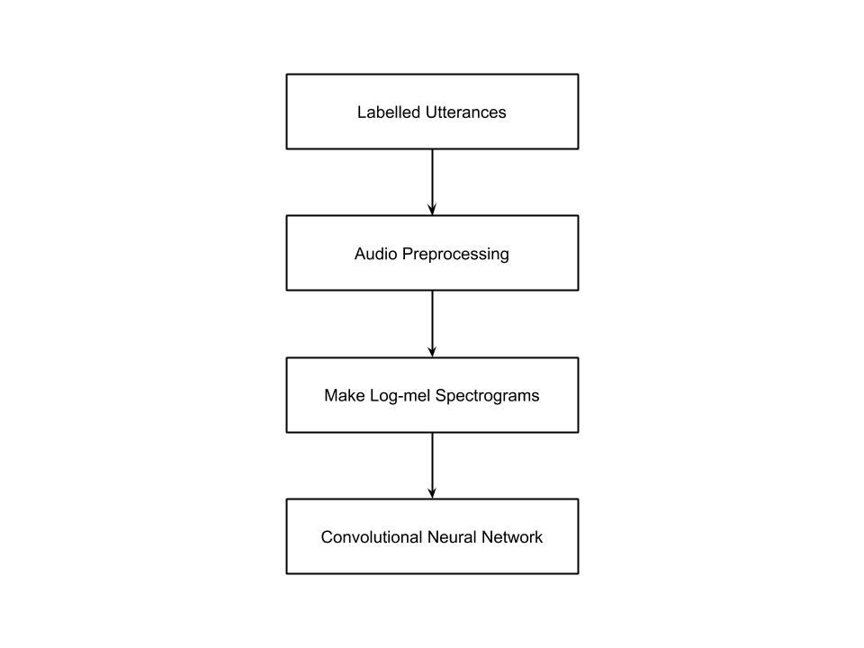
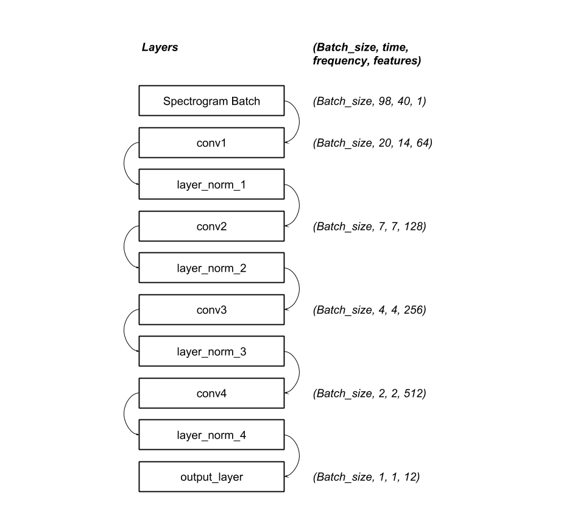

# Convolutional Neural Networks for Keyword Classification
## Introduction
Convolutional neural networks (CNN) are commonly used for image classification because they are able to generalize an image into a set of features. CNNs can be used similarly for audio recognition. Spectrograms of audio clips are classified like images would be. I designed a CNN architecture to classify a small set of short spoken words. Thank you to [tvanslyke](https://github.com/tvanslyke) and Paul Ruvolo for contributions and advice on this project.

This network completes a task based on the TensorFlow Speech Recognition Challenge from Kaggle [found here](https://www.kaggle.com/c/tensorflow-speech-recognition-challenge). My goal was to build a neural network capable of classifying several keywords from the TensorFlow Speech Recognition data set. The keywords classified by the network described here are "yes", "no", "up", "down", "left", "right", "on", "off", "stop", "go", "silence", and "unknown".

I initially decided to work off of the architecture described in the paper, ["Convolutional Neural Networks for Small -footprint Keyword Spotting"](https://www.isca-speech.org/archive/interspeech_2015/papers/i15_1478.pdf), but instead switched to a fully convolutional network due to better performance.

## Data Set
The data set used in this network is the [Speech Commands Dataset](https://ai.googleblog.com/2017/08/launching-speech-commands-dataset.html). The dataset includes one second spoken commands donated by thousands of people. The training set consists of 64721 .wav files.
### Organization
All wavfiles in the training data are organized into labelled directories in the root directory ```train/audio```. As an example, one wavfile in the training set is ```train/audio/go/fd395b74_nohash_0.wav```. The first component is the label of the utterance, in this case 'go'. In the filename itself, there are three components: the speaker ID, 'nohash', and the utterance number. The speaker ID is a unique identifier of the person who donated the utterance to the dataset. One speaker may donate utterances of multiple words, and the speaker ID can be used to ensure that all utterances by one speaker are partitioned into the same set. This keeps the network from learning to identify voices instead of words. The final component is the utterance number. A speaker may contribute multiple utterances of the same word. The first utterance is numbered 0, and subsequent utterances are numbered upwards from there.

The ```_background_noise_``` directory contains a combination of wavfiles of generated noise and recorded noises. These are available to be mixed with the spoken words before they are input into the network to imporve performance.

I include in my network an additional ```_silence_``` directory that includes one files of all 0s. This is meant to be used as the silence samples input to the dataset along with utterances.

## Architecture
The network described here is designed to classify ten utterances as well as differentiate unknown words from silence. The high level overview of the architecture can be seen in the figure below.



All of the architecture is defined symbolically as a TensorFlow graph, which is then run with real data during the training and validation phases.

### Labelled Utterances
The paths to each of the wavfiles in the ```train/audio``` directory are stored in a list. Each label receives its own unique index in the list, and all of the files with that label are contained in a nested list at that index. A batch of labelled utterances is made by randomly choosing labels from the list of categories and then randomly choosing filepaths from the list associated with that label.

### Audio Preprocessing
The wavfiles in the dataset are not loaded until needed, although the runtime speed of the network could be increased at the sacrifice of memory storage by loading the entire dataset into memory at the beginning of the program. Wavfiles are loaded using TensorFlow's tensorflow.contrib.framework.python.ops and tensorflow.python.ops libraries. It is difficult to find documentation online for loading wavfiles with TensorFlow, but two useful resources are TensorFlow's source code for the [Simple Audio Recognition](https://www.tensorflow.org/tutorials/audio_recognition) tutorial (Specifically in [this method](https://github.com/tensorflow/tensorflow/blob/81012dcd91770dc8113cd5beb4f854968c27e272/tensorflow/examples/speech_commands/input_data.py#L327) in input_data.py) and the blog post [Audio processing in TensorFlowMachine Learning WAVE Files with TensorFlow](https://becominghuman.ai/machine-learning-wave-files-with-tensorflow-5a990385fb3e).

After a batch of audio is loaded, it is standardized by subtracting the mean and dividing by the standard deviation of the entire set of training data.

It has been shown that adding some background noise to samples before adding them to the network makes it more robust. So, a scaled segment of noise from a randomly selected background noise file is added to each sample.

### Make Log-mel Spectrograms
A spectrogram is a representation of frequency content of a signal over time. It is created by taking the short time Fourier transform of small overlapping windows of the signal and and plotting them over time. A log-mel spectrogram scales the frequency content of the signal to more closely match how the human ear perceives sound. An example of the spectrogram of an utterance of the word "left" is shown below. 


For this project, each spectrogram is created using 40 mel bins, a frame width of 25 milliseconds, and a frame shift of 10 milliseconds.

The tensorflow.contrib.signal library was used to create the spectrograms. Example code for this library can be found in the  [Signal Processing (contrib)](https://www.tensorflow.org/api_guides/python/contrib.signal#Computing_Mel_Frequency_Cepstral_Coefficients_MFCCs_) tutorial.

### Convolutional Neural Network
The specrograms are fed in batches into a fully convolutional neural network, the layers of which are depicted in the diagram below. The network has five convolutional layers. The first four increase the number of features by powers of two while reducing the dinmensions of the spectrograms.



The layers use a leaky RELU activation function. Layer normalization is applied to the outputs of these four layers. The final convolutional layer reduces the number of features to the number of categories, in this case 12. The kernel size and stride dimensions of the layers are shown in the table below.

 Layer       | Kernel Size | Strides  | Features | Shape 
 ----------- |-------------| ---------| -------- | -----
 input_layer | - | - | 1 | (batch_size, 98, 40, 1) 
 conv1 | (8, 8) | (5, 3) | 64 | (batch_size, 20, 14, 64)
 conv2 | (8, 6) | (3, 2) | 128 | (batch_size, 7, 7, 128)
 conv3 | (5, 5) | (2, 2) | 256 | (batch_size, 4, 4, 256)
 conv4 | (2, 2) | (2, 2) | 512 | (batch_size, 2, 2, 512)
 conv5 | (2, 2) | (2, 2) | 12 | (batch_size, 1, 1, 12)

The loss function apploed to the output of the network is a sparse softmax cross entropy function. The optimizer is uses the Adam optimization algorithm.

## Results
## Future Work
## Reflection
