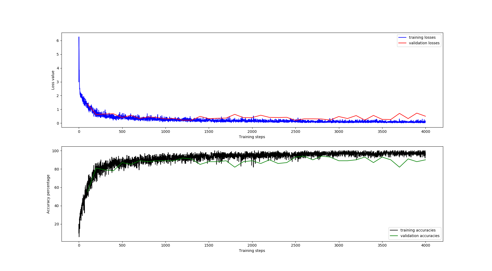
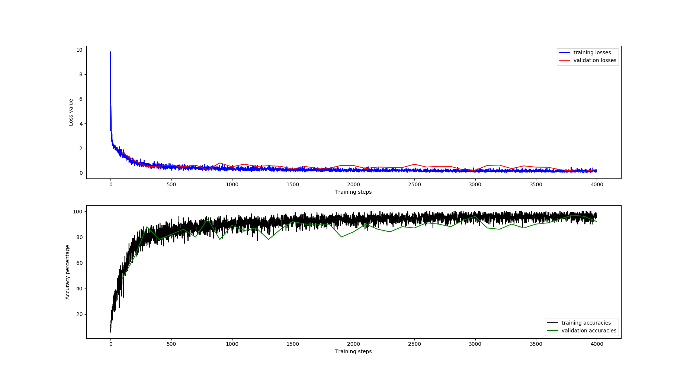

# Convolutional Neural Networks for Keyword Classification
## Introduction
Convolutional neural networks (CNNs) are commonly used for image classification because they are able to generalize an image into a set of features. CNNs can be used similarly for audio recognition. Spectrograms of audio clips are classified like images would be. I designed a CNN architecture to classify a small set of short spoken words. Thank you to [tvanslyke](https://github.com/tvanslyke) and Paul Ruvolo for contributions and advice on this project.

This network completes a task based on the TensorFlow Speech Recognition Challenge from Kaggle [found here](https://www.kaggle.com/c/tensorflow-speech-recognition-challenge). My goal was to build a neural network capable of classifying several keywords from the TensorFlow Speech Recognition data set. The keywords classified by the network described here are "yes", "no", "up", "down", "left", "right", "on", "off", "stop", "go", "silence", and "unknown".

I initially decided to work off of the architecture described in the paper, ["Convolutional Neural Networks for Small -footprint Keyword Spotting"](https://www.isca-speech.org/archive/interspeech_2015/papers/i15_1478.pdf), but instead switched to a fully convolutional network due to better performance.

## Data Set
The data set used in this network is the [Speech Commands Dataset](https://ai.googleblog.com/2017/08/launching-speech-commands-dataset.html). The dataset includes one second spoken commands donated by thousands of people. The training set consists of 64721 .wav files.
### Organization
All wavfiles in the training data are organized into labelled directories in the root directory ```train/audio```. As an example, one wavfile in the training set is ```train/audio/go/fd395b74_nohash_0.wav```. The first component is the label of the utterance, in this case 'go'. In the filename itself, there are three components: the speaker ID, 'nohash', and the utterance number. The speaker ID is a unique identifier of the person who donated the utterance to the dataset. One speaker may donate utterances of multiple words, and the speaker ID can be used to ensure that all utterances by one speaker are partitioned into the same set. This keeps the network from learning to identify voices instead of words. The final component is the utterance number. A speaker may contribute multiple utterances of the same word. The first utterance is numbered 0, and subsequent utterances are numbered upwards from there.

The ```_background_noise_``` directory contains a combination of wavfiles of generated noise and recorded noises. These are available to be mixed with the spoken words before they are input into the network to imporve performance.

I include in my network an additional ```_silence_``` directory that includes one files of all 0s. This is meant to be used as the silence samples input to the dataset along with utterances.

## Architecture
The network described here is designed to classify ten utterances as well as differentiate unknown words from silence. The high level overview of the architecture can be seen in the figure below.


All of the architecture is defined symbolically as a TensorFlow graph, which is then run with real data during the training and validation phases.

### Labelled Utterances
The paths to each of the wavfiles in the ```train/audio``` directory are stored in a list. Each label receives its own unique index in the list, and all of the files with that label are contained in a nested list at that index. A batch of labelled utterances is made by randomly choosing labels from the list of categories and then randomly choosing filepaths from the list associated with that label.

### Audio Preprocessing
The wavfiles in the dataset are not loaded until needed, although the runtime speed of the network could be increased at the sacrifice of memory storage by loading the entire dataset into memory at the beginning of the program. Wavfiles are loaded using TensorFlow's tensorflow.contrib.framework.python.ops and tensorflow.python.ops libraries. It is difficult to find documentation online for loading wavfiles with TensorFlow, but two useful resources are TensorFlow's source code for the [Simple Audio Recognition](https://www.tensorflow.org/tutorials/audio_recognition) tutorial (Specifically in [this method](https://github.com/tensorflow/tensorflow/blob/81012dcd91770dc8113cd5beb4f854968c27e272/tensorflow/examples/speech_commands/input_data.py#L327) in input_data.py) and the blog post [Audio processing in TensorFlowMachine Learning WAVE Files with TensorFlow](https://becominghuman.ai/machine-learning-wave-files-with-tensorflow-5a990385fb3e).

After a batch of audio is loaded, it is standardized by subtracting the mean and dividing by the standard deviation of the entire set of training data.

It has been shown that adding some background noise to samples before adding them to the network makes it more robust. So, a scaled segment of noise from a randomly selected background noise file is added to each sample.

### Make Log-mel Spectrograms
A spectrogram is a representation of frequency content of a signal over time. It is created by taking the short time Fourier transform of small overlapping windows of the signal and and plotting them over time. A log-mel spectrogram scales the frequency content of the signal to more closely match how the human ear perceives sound. An example of the spectrogram of an utterance of the word "left" is shown below. 


For this project, each spectrogram is created using 40 mel bins, a frame width of 25 milliseconds, and a frame shift of 10 milliseconds.

The tensorflow.contrib.signal library was used to create the spectrograms. Example code for this library can be found in the  [Signal Processing (contrib)](https://www.tensorflow.org/api_guides/python/contrib.signal#Computing_Mel_Frequency_Cepstral_Coefficients_MFCCs_) tutorial.

### Convolutional Neural Network
The specrograms are fed in batches into a fully convolutional neural network, the layers of which are depicted in the diagram below. The network has five convolutional layers. The first four increase the number of features by powers of two while reducing the dinmensions of the spectrograms.


The layers use a leaky RELU activation function. Layer normalization is applied to the outputs of these four layers. The final convolutional layer reduces the number of features to the number of categories, in this case 12. The kernel size and stride dimensions of the layers are shown in the table below.

 Layer       | Kernel Size | Strides  | Features | Shape 
 ----------- |-------------| ---------| -------- | -----
 input_layer | - | - | 1 | (batch_size, 98, 40, 1) 
 conv1 | (8, 8) | (5, 3) | 64 | (batch_size, 20, 14, 64)
 conv2 | (8, 6) | (3, 2) | 128 | (batch_size, 7, 7, 128)
 conv3 | (5, 5) | (2, 2) | 256 | (batch_size, 4, 4, 256)
 conv4 | (2, 2) | (2, 2) | 512 | (batch_size, 2, 2, 512)
 conv5 | (2, 2) | (2, 2) | 12 | (batch_size, 1, 1, 12)

The loss function apploed to the output of the network is a sparse softmax cross entropy function. The optimizer is uses the Adam optimization algorithm.

## Results
### Without Noise

As can be seen above, the network learns quickly on the standardized audio with no addtional background noise, and then returns diminish with more training steps. The network whose losses and accuracies is shown above was trained with a learning rae of 0.0001. 10% of the labelled dataset was used for validation. At it's best, the network can perform with around 90% accuracy. Notice that around training step 1400, the validation losses and accuracies begin to deviate away from the trend in training loss and accuracies and decrease. This means that the network is most likely overfit to the data in the training partition. The number of iterations through the training data should be decreased to account for this, however, the overfitting problem may also be improved by adding background noise to the samples.
### With Added Noise

The plots above depict the losses and accuracies of the network when some background noise is added to the samples. In this case, the noise was scaled between 0 and 0.3 of its original amplitude before being added to the data. Adding this noise appears to help with the overfitting problem, which means that the accuracy of the network slightly improves. For this run, the background noise was randomly selected from the available files, but always the first second of the clip was used, and not a random slice of the much longer clip. It would be interesting to see how the performance of the network may change if there is a greater variety to the added noise.

## Future Work
There are a lot of improvements that can be made to the network and extra features to be built on top of it. One of the additional features that would be interesting would be to build a test program that classifies spoken words that it prompts from the user. Additionally, more metrics of the performance could be measured, and variations of the audio preprocessing could be implemented to see if performance can be improved in this way.

As a general imprivement, I would like to work on the organization of the code to make it more flexible to different experiments. I would also like to better document functions that are lacking in explanation.
## Reflection
At the beginning of this self study, I had the following learning goals:
- Learn about the tools and strategies used to solve problems with machine learning
- Gain a deeper understanding of audio coding and how humans and computers process sound
- Create a well-documented tool that can be shared with the wider community

This project went in a different direction than I initially intended. I was hoping that this project would address the second learning goal more in depth than it did. Although I did learn how to use spectrograms for machine learning, this was not the bulk of the time spent on the project. Most of my time went into learning how to use TensorFlow effectively, which heavily addressed the first learning goal. I am happy with my learnings on this project, however I think that if I were to redesign the curriculum of this course, I would give much more time to the final project and I would focus less heavily on also trying to learn another specific skill such as audio processing. I think that I am still in the progress of making a well documented tool, but I would like to continue working on this network as a side project, so hopwfully I will reach this goal to the level I set myself.

Some of the biggest challenges on this project were learning how to use and debug TensorFlow, and designing an effective convolutional network without a regular class structure where I would have much more interaction with professors, teaching assistants, and fellow classmates to work out problems. It took a much longer time than I expected to debug my problems as they popped up without this level of support.

Overall, I am very happy with my learning throughout this project. I feel comfortable with TensorFlow, and I have the tools to continue learning about other applications of audio machine learning.
