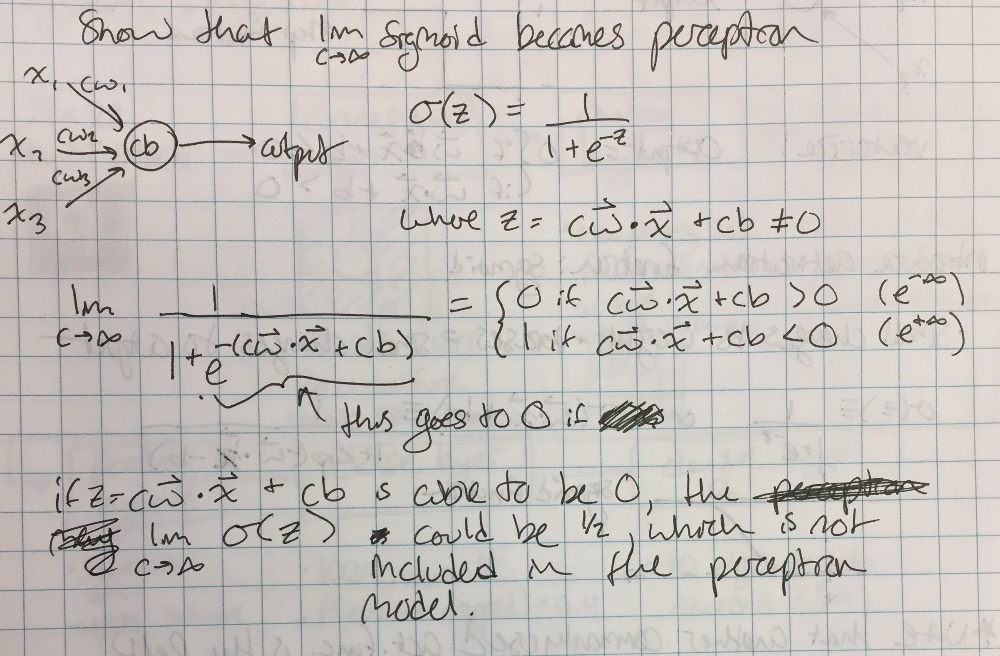

# Neural Networks and Deep Learning Chapter 1
[Link to chapter](http://neuralnetworksanddeeplearning.com/chap1.html)
## Exercises
### Sigmoid neurons simulating perceptrons, part 1
#### Suppose we take all the weights and biases in a network of perceptrons, and multiply them by a positive constant, c > 0. Show that the behaviour of the network doesn't change.

Multiplying the weights vector, w, by c is equivalent to multiplying the dot product of the inputs and the weights by c

dot(cw, x) = c * dot(w, x)

So the inequality is expressed as:

c * dot(w, x) + c * b ?> 0

c can be cancelled out to leave the original inequality

dot(w, x) + b ?> 0

So the behavior of the network will not change as long as every weight and bias vector is multiplied by c.

### Sigmoid neurons simulating percetrons, part 2
#### Suppose that we have a network of sigmoids with a fixed input. The weights and biases are such that dot(w, x) + b is not 0. Multiply the weights and biases by c > 0. Show that in the limit as c goes to infinity, the behavior of the network is the same as a network of perceptrons. How can this fail when dot(w, x) + b is allowed to be 0?

### Add a final layer to the simple digit classifier network that converts digits to binary. Choose weights and biases assuming that a correct digit will have an activation > 0.99 and an incorrect digit will have an activation of < 0.01.

2^0 neuron: w = [0 1 0 1 0 1 0 1 0 1]; b = -0.14

2^1 neuron: w = [0 0 1 1 0 0 1 1 0 0]; b = -0.04

2^2 neuron: w = [0 0 0 0 1 1 1 1 0 0]; b = -0.04

2^3 neuron: w = [0 0 0 0 0 0 0 0 1 1]; b = -0.11